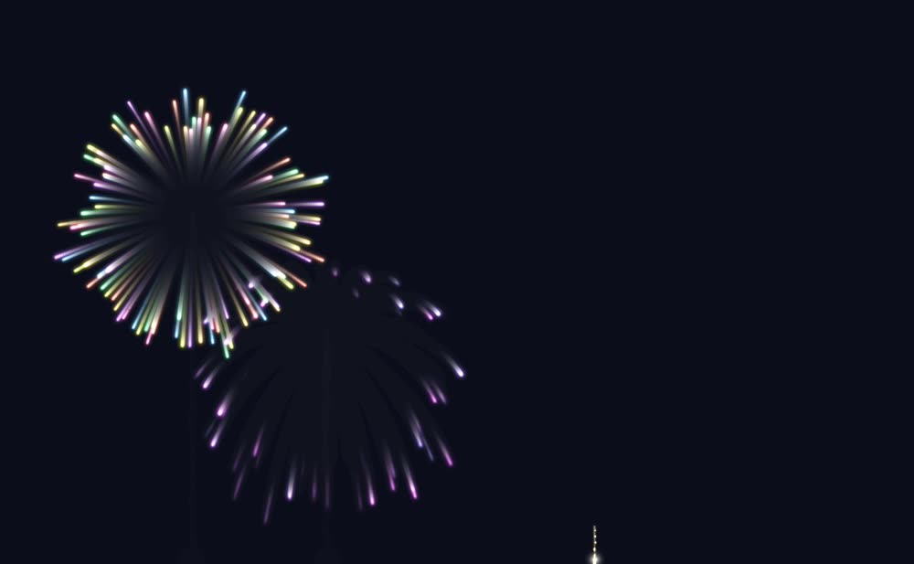

# @weibaohui/dsh-fireworks

dsh 插件 · **烟花庆祝引擎**：你在 aai 编程，它在对话窗口上空放烟花。


## 关键帧

| 开场迎宾（双子星） | 多弹齐放 | 绯蕊（蕊心双色） |
| --- | --- | --- |
|  |  |  |

| 里程碑（一发多色 bands） | 蓝柳与珍珠 | 收工终场（金色瀑布） |
| --- | --- | --- |
|  |  |  |

```
session/created ──→ 开场迎宾      tool/result ✓ ──→ 工具星花（N 次连放）
turn/end       ──→ 回合礼花       tool/result ✗ ──→ 哑炮 / 冷雨
累计 token 跨档 ──→ 里程碑大礼     todo 全部完成 ──→ 收工终场齐射
```

**token 用量决定烟花的大小、爆炸高度与艳丽绚烂程度**：每回合累计的
`outputTokens + 0.2×inputTokens` 经 log₂ 曲线映射为 magnitude（0..1），
属性卡里所有关键参数（星数、爆速、高度、亮度、饱和度）都是区间，
由 magnitude 插值落定——几百 token 是一朵小礼花，几万 token 就是漫天大礼。

## 快速预览（不用装插件）

```bash
open demo/demo.html          # 或浏览器直接打开；?shot=1 自动连放、?demo=1 录播编排
```

## 渲染架构（GPGPU）

默认走 **WebGL2 累积缓冲渲染器**（client/renderer-webgl.js）：

```
每条拖尾不是画出来的，是「攒」出来的——
三条累积纹理（短/中/长拖尾桶，衰减 0.80 / 0.88 / 0.94，帧率无关折算）
  每帧：桶纹理整体乘衰减（指数衰减即丝滑拖尾）→ 本帧粒子加法盖章
  合成：三桶相加直写画布（预乘 alpha，页面内容自然透出）
```

- 全部粒子**一次 draw call**，每帧总 draw call ≈ 9；实测 5700+ 粒子极端
  齐射锁定 60fps（Canvas2D 兜底路径同负载约 45fps）
- 运动补偿子步盖章：高速星体沿运动矢量补盖中间点，拖尾连续无断点
- 点精灵片元做径向衰减（白炽芯 + 二次方辉光晕），颜色随生命演进
  （白芯→本色→色相漂移）由 CPU 以顶点属性传入
- 累积纹理 DPR 封顶 1.5、长边封顶 2400：辉光不需要视网膜锐度，显存减半
- **浅色主题自适应**：采样页面底色亮度（elementFromPoint 穿透画布），
  白底下自动切换墨色渲染——深饱和线条、关白炽芯、弱爆闪、整体压暗，
  不会出现白团盖内容
- WebGL2 不可用（老浏览器/上下文丢失/shader 编译失败）自动回退
  Canvas2D 渲染器（位置历史逐段描边拖尾），设置页可见当前渲染器

## 工作原理

```
宿主（src/index.js）                     客户端（client/）
─────────────────                       ─────────────────
session/event 事件流                     全屏透明 canvas 浮层
  ↓ 分类 / 累计 token / 合批               (fixed, pointer-events:none)
celebrate {category,                      EventSource 订阅 SSE
           magnitude, count, seq}  ──→     ↓ pickVariants 洗牌袋抽变种
        SSE /dsh-fireworks/api/stream      ↓ resolveCard 落定参数
                                          GPGPU 引擎渲染
```

- **宿主**订阅 `session/event`，把六类工作事件翻译成庆祝事件，经 SSE
  广播（dsh-flow 同款路由与信任栅栏）。工具成功事件在 1.4s 窗口内合批——
  「一批 5 次工具调用」→ 客户端「从工具卡组随机抽 5 个不同变种连放」。
  全局限流（令牌桶 10 枚/5s）防子 agent 风暴刷屏。
- **客户端**挂漂浮画布，按类别从属性卡组抽变种播放。洗牌袋不放回抽取，
  袋空重洗；稀有度高的卡入袋概率低（传说卡约 44% 的袋才出现一次）。
  同一 seed 的事件在所有客户端播放同一组变种。

## 六类事件 × 30 张属性卡

| 类别 | 触发 | 变种 |
|---|---|---|
| session 开场迎宾 | 新会话（顶层线程） | 银茧迎宾 / 青门初开 / 紫雾晨星 / 春柳拂晓 / 双子星 |
| turn 回合礼花 | 每轮回复完成，规模随 token | 金牡丹 / 七彩菊 / 翡翠频闪 / 绯蕊 / 蓝柳 / 琥珀十字 |
| tool 工具星花 | 工具调用成功（合批连放） | 薄荷脆响 / 天彗 / 珍珠落 / 青柠气泡 / 玫瑰针 |
| milestone 里程碑 | 累计 output 跨 2k/8k/20k/50k/120k/300k | 大锦冠 / 烈焰之心 / 铸星 / 土星冠 / 雷鸣礼炮 |
| finale 收工终场 | todo 全部完成（多弹齐射） | 寰宇终章 / 黄金时代 / 极光之舞 / 龙戏珠 / 千星落幕 |
| fail 哑炮 | 工具失败（克制的幽默安慰） | 哑炮 / 冷雨 / 落灰 / 一缕烟 |

## 属性卡 schema（client/cards.js）

每张卡是一类烟花的一个变种，参数详尽且全部为纯数据；`resolveCard(card,
mag, rng)` 把区间按 magnitude 插值（scaling 指定 linear/sqrt/log 曲线）
加抖动后产出引擎直接消费的发射谱。

```js
{
  id: 'peony-gold', name: '金牡丹', nameEn: 'Golden Peony',
  category: 'turn',           // 事件类别
  rarity: 1,                  // 1 常见 … 5 传说；入袋概率 min(1, 2.2/rarity)
  flavor: '最经典的金色牡丹。',

  rocket: {                   // 弹体升空
    kind: 'rocket',           // rocket 尾焰升空 | mine 地面直喷 | none 空中直接出现
    apex: [0.5, 0.82],        // 爆炸高度 = 视口高度比例（mag 插值）
    speed: [640, 900],        // 升空初速 px/s
    wobble: 4,                // 上升摆动幅度
    trailRate: 90,            // 上升火星拖尾速率 颗/s
    trailColor: [42, 90, 62], // 拖尾颜色 [h,s,l]
    trailLife: [0.25, 0.5],   // 拖尾火星寿命 s
    trailGravity: 120,        // 拖尾重力 px/s²
    trailSize: [0.8, 1.6],
  },

  burst: {                    // 爆炸
    shell: 'peony',           // 花型（见下）
    stars: [100, 230],        // 星数（mag 插值，scaling.stars 曲线）
    speed: [200, 360],        // 爆炸初速 px/s
    spread: 1,                // 各向异性
    ringThickness: 0.14,      // ring 类环厚
    gravity: 42, drag: 0.55,  // 重力 px/s²，速度阻尼 /s
    starLife: [1.4, 2.4],     // 星体寿命 s
    starSize: [1.5, 3],       // 星体半径 px
    trail: { len: [6, 12], fade: 0.82 },  // 拖尾长度（历史点数）与衰减
  },

  color: {
    palette: [[45,100,62], …],// [h,s,l] 调色板（PALETTES 库 18 组）
    mode: 'random',           // uniform 单色 | random 每星随机 |
                              // rainbow 轮转 | gradient 首尾渐变 | split 分相
    bands: [                  // 一发多色：按概率配比混色（可选，优先于 mode）
      { palette: PALETTES.gold, p: 0.65 },     // 65% 的星落金色组
      { palette: PALETTES.crimson, p: 0.35 },  // 35% 落绯红组（p 自动归一化）
    ],
    mixChance: 0.65,          // 本次发射启用多色配比的概率（缺省 0.65；
                              // 未启用时整弹用单一 palette）
    hueDrift: 0,              // 生命期内色相漂移 deg/s（金→白等）
    lighten: [4, 18],         // 亮度提升（mag 插值 = 艳丽度）
    saturation: [0, 0],       // 饱和度提升
    whiteCore: true,          // 初生 15% 生命白炽核心
  },

  effects: {                  // 二级效果（null 关闭）
    strobe:    { rate: 9, duty: 0.5 },        // 频闪：方波明灭 hz / 占空比
    twinkle:   { rate: 3, depth: 0.35 },      // 闪烁：正弦明暗
    crackle:   { at: 0.62, count: [2,4],      // 爆裂：生命 62% 处喷微型火星
                 speed: [40,90], life: [0.25,0.5] },
    glitter:   { rate: 6, depth: 0.5 },       // 微光：亮度快速振荡
    crossette: { at: 0.55, count: 4, angle: 90 },  // 十字分裂
    pistil:    { stars: [24,44], color: PALETTES.silver, // 蕊心：内层第二爆
                 speedRatio: 0.42, lifeRatio: 0.8 },
    flash:     { radius: [180,320], life: [0.22,0.4] },  // 爆闪（礼炮白闪）
    trailBloom: true,                          // 尾端结花（锦冠）
  },

  scaling: { stars: 'sqrt', apex: 'linear', speed: 'sqrt', vivid: 'linear' },

  volley: { count: [3,3], interval: [0.28,0.4], spread: 0.5 },  // 齐射
}
```

### 花型（burst.shell）

`peony` 牡丹（干净球面）· `chrysanthemum` 菊（长拖尾球面）· `willow` 柳
（高重力垂丝）· `kamuro` 冠毛（低速绒球）· `strobe` 频闪球面 ·
`crossette` 十字裂 · `pistil` 带蕊心球面 · `ring` 圆环 · `doubleRing` 双环
· `heart` 心形 · `star` 五角星 · `saturn` 土星（球+扁环）·
`tourbillion` 旋花（切向旋转）· `brocade` 锦冠（结花拖尾）·
`waterfall` 瀑布（超长尾缓落）· `salute` 礼炮（爆闪+爆裂）·
`mineFan` 地面扇形 · `comet` 彗星 · `dud` 哑炮（弹体坠落）·
`drizzle` 冷雨

### 新增一张卡

1. 在 `client/cards.js` 对应类别的数组里加一张 `card({...})`
   （缺省段自动补全，只需写差异参数）；
2. `npm test` 会自动校验必填字段、色域合法性与区间方向；
3. `npm run build:client` 重新生成 bundle；
4. `demo/demo.html` 里即可试放。

### 全局密度/尺寸旋钮

`cards.js` 顶部的 `TUNE = { stars: 0.5, size: 1.65, pistil: 0.6 }` 统一缩放
所有卡的星数与星体尺寸（少而精：颗颗分明、动画流畅、色彩艳丽），
不改变 token 缩放曲线——大 token 依旧更大更高更艳。

## 引擎（client/engine.js）

物理与生命周期核心，渲染外包给双路径渲染器（WebGL2 优先，Canvas2D 兜底），
零 npm 依赖（参考 fireworks-js / 经典 canvas 粒子烟花，按「盖在对话窗口
上的透明浮层」重写）。

- 火箭升空：摆动 + 火星拖尾 + 点火闪光 + 按预估爆半径自动钳制爆炸高度
- 星体：重力 + 指数阻尼，二级效果齐备（频闪/闪烁/爆裂/十字分裂/蕊心/
  爆闪/尾端结花）
- 粒子硬上限、帧时滑动平均自动降质、页面隐藏暂停、
  `prefers-reduced-motion` 自动停放、WebGL 路径零 CPU 轨迹历史（无 GC 压力）

## HTTP API（宿主）

| 路由 | 说明 |
|---|---|
| `GET /dsh-fireworks/api/stream` | SSE 庆祝事件流 |
| `GET /dsh-fireworks/api/config` | 读配置 |
| `POST /dsh-fireworks/api/config` | 存配置（storageDomain 持久化） |
| `POST /dsh-fireworks/api/test` | 试放 `{ category?, magnitude? }` |

## 设置页

设置 → 烟花庆祝：总开关、全局强度（0.3–2.5）、**显示范围**（全屏 /
左部侧边栏 / 右部侧边栏 / 左下角 / 右下角——角落区域像小组件，不挡
对话内容；引擎坐标系相对画布，区域缩小自动按比例缩小烟花）、六类事件
独立开关、每类试放按钮、引擎实时状态（粒子数/画质/渲染器/连接状态）。

## 开发

```bash
npm run check          # 语法检查
npm test               # 11 项离线测试（卡组完整性/洗牌袋/缩放/宿主公式）
npm run build:client   # cards.js + engine.js + index.js → client/bundle.js
```

浏览器控制台调试：`__dshFireworks.fire('finale', 0.9)` 随手放一发。

## 版本兼容性

| 插件版本 | 适配 dsh 版本 | 备注 |
|---------|--------------|------|
| 0.1.0 | 0.1.7-rc.2 | 首个版本 |

## License

MIT
